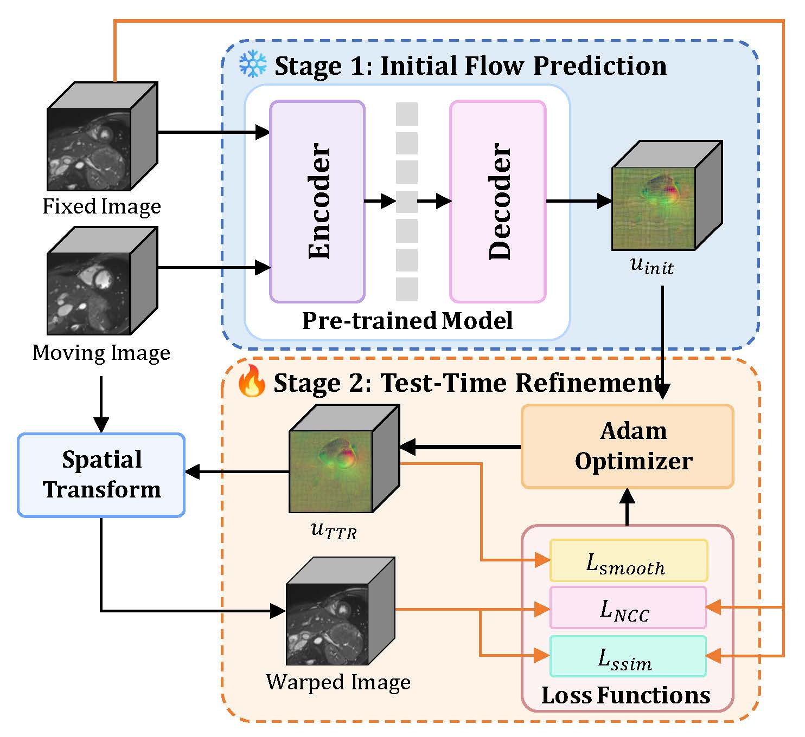
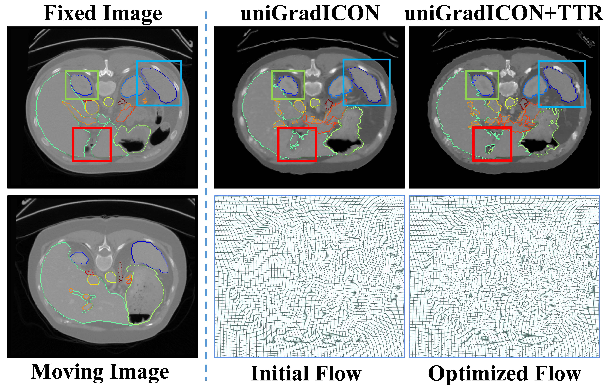
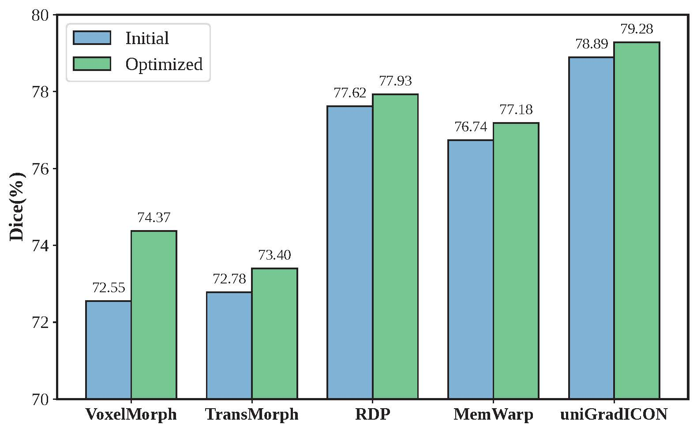

# Reg-TTR, Test-Time Refinement for Fast, Robust and Accurate Image Registration


 <a href="https://opensource.org/licenses/MIT"> <a href="https://opensource.org/licenses/MIT"></a> [](https://doi.org/10.48550/arXiv.2601.19114)


This repository hosts the official PyTorch implementation of "REG-TTR, Test-Time Refinement for Fast, Robust and Accurate Image Registration". Reg-TTR is an efficient test-time refinement framework for medical image registration that synergizes the complementary strengths of deep learning and conventional registration techniques. It can achieve state-of-the-art registration accuracy on diverse medical image registration tasks while maintaining fast inference speeds close to mainstream deep learning-based methods, with only 21% additional inference time (0.56s) incurred by the refinement process. We have demonstrated its efficacy in unsupervised inter-subject [Abdomen CT](https://drive.usercontent.google.com/download?id=1aWyS_mQ5n7X2bTk9etHrn5di2-EZEzyO&export=download&authuser=0) registration and unsupervised intra-subject cardiac MR ([ACDC](https://www.creatis.insa-lyon.fr/Challenge/acdc/databases.html) dataset) registration, and verified its generalizability in boosting the performance of various pre-trained registration models including registration foundation models and task-specific specialized models.

<p align="center">
    
</p>


## Highlights

<p align="center">
    
</p>

<p align="center">
    
</p>

<p align="center">
    
</p>

Reg-TTR is a novel efficient test-time refinement framework for medical image registration, which can be incorporated with various pre-trained registration models like registration foundation models ([uniGradICON](https://github.com/uncbiag/uniGradICON)), task-specific specialized models ([VoxelMorph](https://github.com/voxelmorph/voxelmorph), [TransMorph](https://github.com/junyuchen245/TransMorph_Transformer_for_Medical_Image_Registration)) and [RDP](https://github.com/ZAX130/RDP), [MemWarp](https://github.com/tinymilky/Mem-Warp) to achieve superior registration accuracy while maintaining fast inference speed.


## Datasets
Pretrained Weights for uniGradICON 
The pre-trained weights of the uniGradICON registration foundation model used in this project are obtained directly from the official release of the uniGradICON model. You can find the uniGradICON model weights [here](https://github.com/uncbiag/uniGradICON/releases).

The datasets used are **[Abdomen CT](https://drive.usercontent.google.com/download?id=1aWyS_mQ5n7X2bTk9etHrn5di2-EZEzyO&export=download&authuser=0)** and **[ACDC](https://www.creatis.insa-lyon.fr/Challenge/acdc/databases.html)**.

## Usage
Run the following commands in the `./src` folder to reproduce the results:

```plain
python testabdomen.py -m UniGradICON -d abdomenreg -bs 1 --num_classes 14
python testACDC.py -m UniGradICON -d acdcreg -bs 1 --num_classes 4
```

- `-m UniGradICON`: Model name, set to "UniGradICON".
- `-d abdomenreg`: Dataset used, specifically "abdomenreg".
- `-bs 1`: Batch size, defined as 1.

## Citation
If our work has influenced or contributed to your research, please kindly acknowledge it by citing:
```
@article{chen2026reg,
  title={Reg-TTR, Test-Time Refinement for Fast, Robust and Accurate Image Registration},
  author={Chen, Lin and He, Yue and Zhang, Fengting and Wang, Yaonan and Lin, Fengming and Chen, Xiang and Liu, Min},
  journal={arXiv preprint arXiv:2601.19114},
  year={2026}
}
```

## Acknowledgment
We extend our sincere appreciation to [UniGradICON](https://github.com/uncbiag/uniGradICON) and [ConvexAdam](https://github.com/multimodallearning/convexAdam) for their important contributions. Portions of the code in this repository are adapted from these projects.

###### Keywords
Keywords: Medical image registration, Test-time refinement, Registration foundation model, Instance optimization
